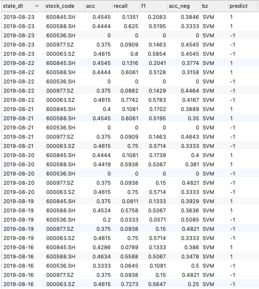
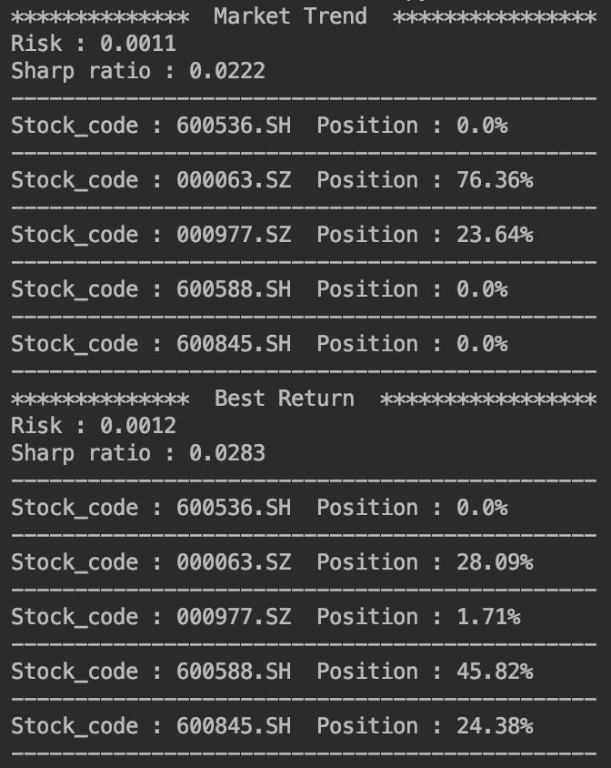

# QT_Test

主要为了重现一套比较简单且完备的量化框架，该框架基于现代投资组合理论，并应用主流的机器学习算法进行分析。 旨在初步形成一个量化投资的思路，辅助构建科学合理的投资策略。

## 环境准备

建议使用Python版本：3.6及以上

### 安装及升级tushare

```shell
pip install tushare
pip install tushare --upgrade
```

### 导入tushare

```python
import tushare as ts
```

tushare版本需大于1.2.10

### 设置token

```python
ts.set_token('Your token')
```

完成调取tushare数据凭证的设置，通常只需要设置一次

### 初始化pro接口

```python
pro = ts.pro_api()
# 或者在初始化中直接设置token
pro = ts.pro_api('your token')
```

## 主要过程

- 数据采集预处理后建模
  - 基于[Tushare](https://tushare.pro/document/1?doc_id=131)进行交易数据采集（[股票](https://github.com/FDUJiaG/QT_Test/blob/master/codes/Init_StockALL_Sp.py)，[指数](https://github.com/FDUJiaG/QT_Test/blob/master/codes/stock_index_pro.py)）
  - 简单[数据预处理](https://github.com/FDUJiaG/QT_Test/blob/master/codes/DC.py)，生成训练集
  - 利用[SVM](https://blog.csdn.net/b285795298/article/details/81977271)算法进行[建模](https://github.com/FDUJiaG/QT_Test/blob/master/codes/Model_Evaluate.py)，并[预测涨跌](https://github.com/FDUJiaG/QT_Test/blob/master/codes/SVM.py)情况

- 模型简单评估和仓位管理
  - 测试区间内的[Precision，Recall，F1](https://blog.csdn.net/zhihua_oba/article/details/78677469)，Negative_Accuracy值[计算](https://github.com/FDUJiaG/QT_Test/blob/master/codes/Model_Evaluate.py)
  -  基于[马科维茨理论](https://mp.weixin.qq.com/s/neCSaWK0c4jzWwCfDVFA6A)的[仓位管理](https://github.com/FDUJiaG/QT_Test/blob/master/codes/Portfolio.py)

- 模拟交易测试及回测

## 主要包
```python
import datetime
import pymysql.cursors
from sklearn import svm
import numpy as np
import pandas as pd
import sqlalchemy
```

## 主要接口函数
```python
pro.daily()       # 获取日K数据（未赋权）
pro.trade_cal()   # 获取交易日历
```

## 示例
### 数据下载


### 存储到MySQL


### 单个SVM结果


### SVM模型评价存储


### 仓位管理

